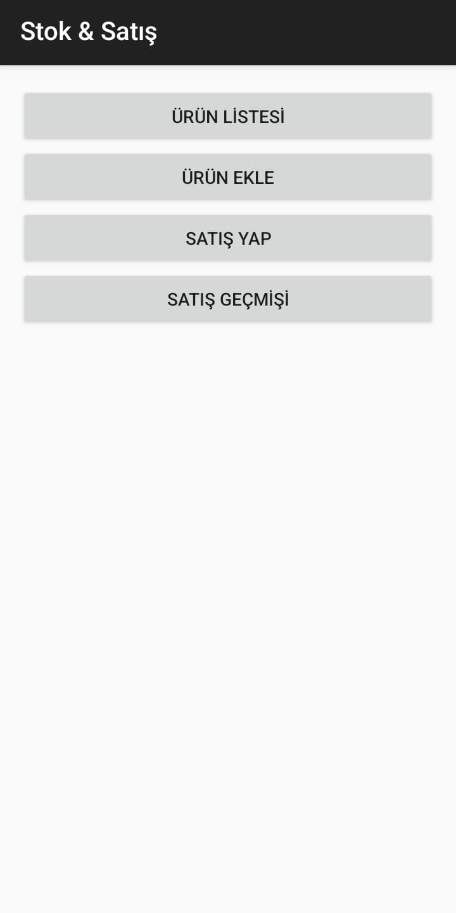
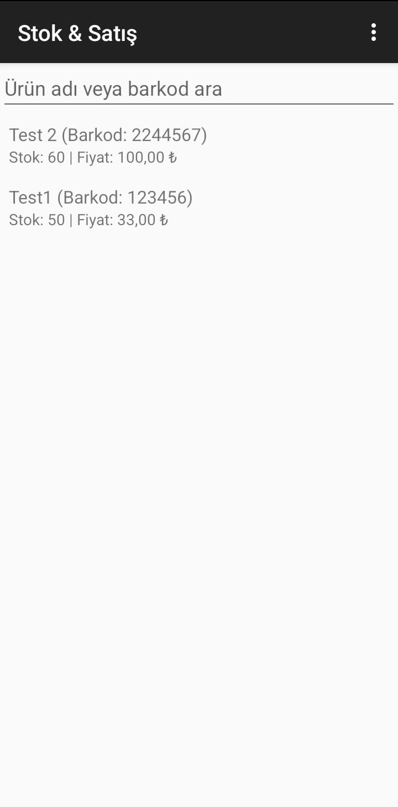
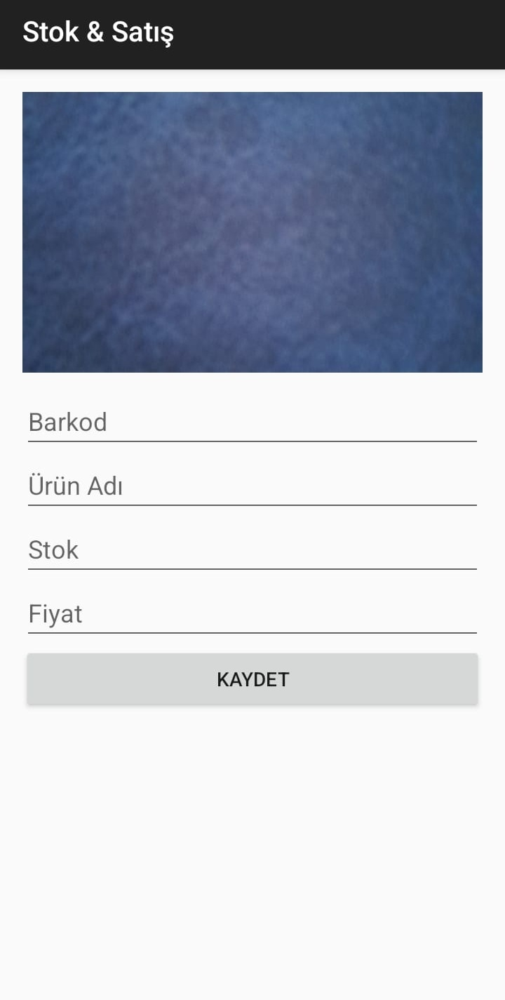
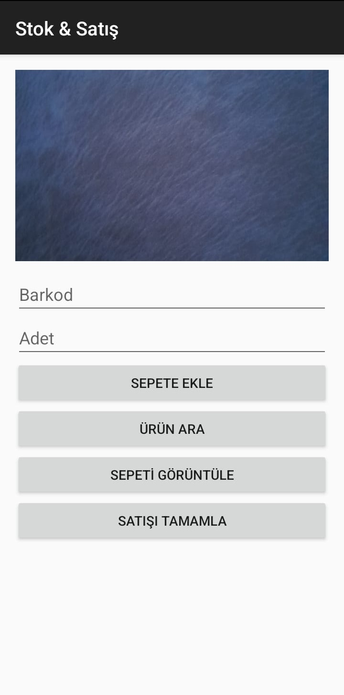
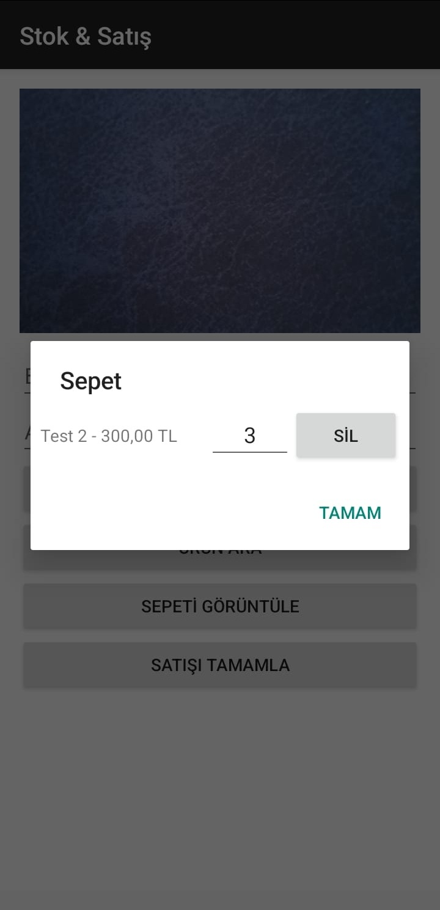
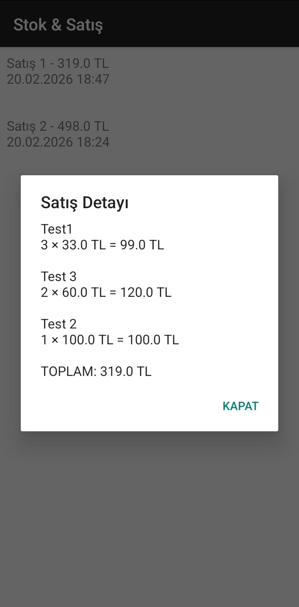
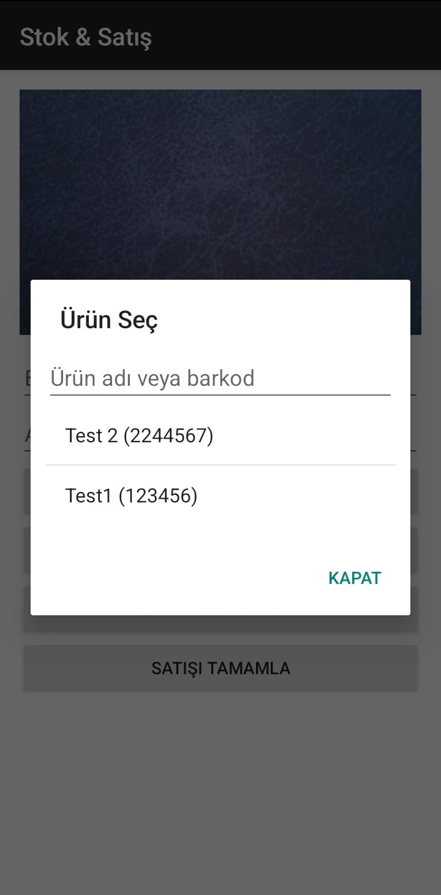
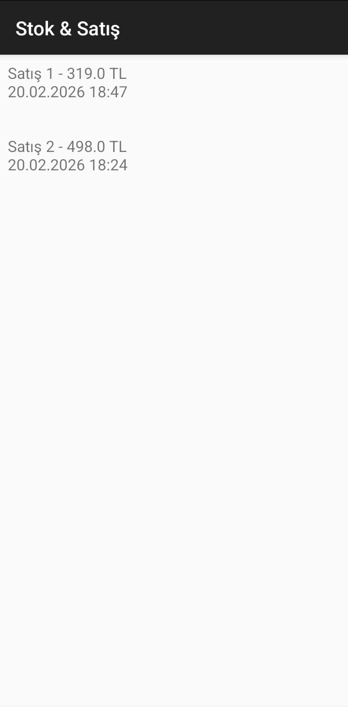

# 📦 Stok & Satış

**Stok & Satış**, küçük işletmelerin günlük ürün, stok ve satış süreçlerini tek bir uygulama üzerinden yönetebilmesi için geliştirilmiş, barkod destekli bir Android uygulamasıdır.

Uygulama; sade arayüzü, hızlı kullanım yapısı ve gerçek kullanım senaryolarına uygun tasarımıyla, temel ihtiyaçlara odaklanan pratik bir çözüm sunar.

---

## 🚀 Özellikler

- 📋 Ürün ekleme ve listeleme  
- 📦 Stok takibi  
- 🛒 Satış işlemleri  
- 🧾 Satış geçmişini tarih, saat ve toplam tutar bazında görüntüleme  
- 📷 Barkod okuma desteği  
- ✍️ Barkod alanında manuel düzenleme imkânı  

---

## 🎯 Çıkış Noktası

Bu proje, benzer niyetlerle geliştirilmiş **ücretsiz ve sade** bir mobil uygulama ihtiyacının karşılanamaması nedeniyle ortaya çıkmıştır.

**Temel ihtiyacı doğrudan çözen**, öğrenme eğrisi düşük ve pratik bir uygulama geliştirme hedefiyle **Stok & Satış** hayata geçirilmiştir.

---

## 🧠 Kullanım Yaklaşımı

Uygulama, gerçek hayatta karşılaşılan senaryolar göz önünde bulundurularak tasarlanmıştır.

Barkod okuma sürecinde:
- Kullanıcı gereksiz tekrar taramalara zorlanmaz  
- Kamera açık kalabilir  
- Barkod değeri manuel olarak düzenlenebilir  

Bu yaklaşım, hız ve esnekliği ön planda tutan bilinçli bir kullanıcı deneyimi tercihini yansıtır.

---

## 🏗️ Teknik Detaylar

- **Platform:** Android  
- **Dil:** Kotlin  
- **Veritabanı:** Room (Local Database)  
- **UI:** XML  
- **Mimari:** Basit, okunabilir ve sürdürülebilir yapı  

Temiz ve anlaşılır bir kod yapısına sahiptir.

--- 

## 📸 Uygulama Ekran Görüntüleri

  
  
  

  
  
  

  
  
  

---

## 📂 Proje Durumu ve 🤖 Yapay Zekâ Desteği

Bu uygulamanın geliştirme sürecinde;  
kod organizasyonu, mimari kararlar ve teknik problem çözme aşamalarında  
yapay zekâ destekli araçlardan faydalanılmıştır.

Tüm uygulama mantığı, kararlar ve son kontrol süreci geliştirici tarafından yürütülmüştür.

- Uygulama aktif ve çalışır durumdadır  

---

## 🙏 Özel Teşekkür

Bir proje ortaya çıkartmak sadece sabır işi değildir.
Size güvenen kişiler olması ve arkanızda durmaları da çok önemlidir ve bende bu konuda 'şans'lı olanlardanım.

Geliştirme sürecinde her zaman bana güvenen ve motivasyon kaynağım olan

Kıymetli arkadaşıma en içten teşekkürlerimi sunuyorum 🌹 

---

## 📦 APK (Releases)

Uygulamanın derlenmiş **APK** dosyasına GitHub Releases sayfası üzerinden ulaşabilirsiniz:

🔗 https://github.com/Nicikernamer/Stok-ve-Satis/releases
